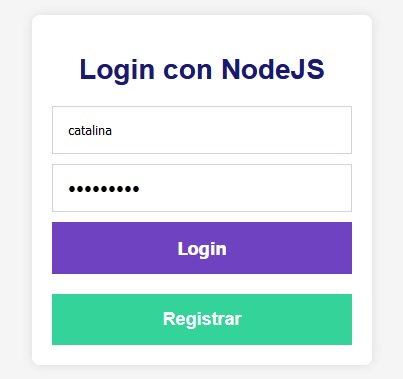
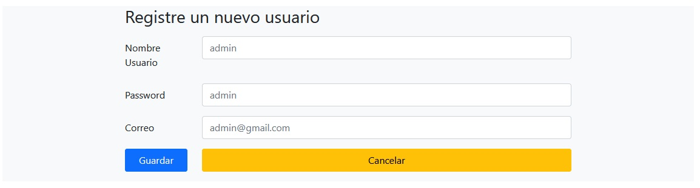
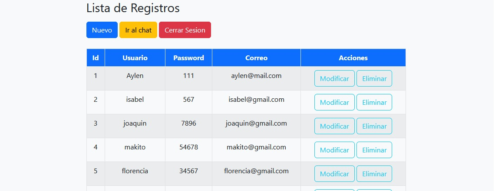

# CRUD Básico

## Descripción

Este proyecto es una aplicación CRUD básica para gestionar registros de usuarios. Permite realizar operaciones de creación, lectura, actualización y eliminación (CRUD) de usuarios a través de una interfaz web. Además, incluye funcionalidades para el registro y autenticación de usuarios.

## Funcionalidades

- **Registro de Usuario:** Los usuarios pueden registrarse proporcionando un nombre de usuario y una contraseña.
- **Autenticación:** Los usuarios pueden iniciar sesión con sus credenciales. Si las credenciales son correctas, se muestra un mensaje de bienvenida.
- **Visualización de Registros:** Se muestra una lista de todos los usuarios registrados en la base de datos.
- **Edición de Usuario:** Permite modificar los detalles de un usuario específico.
- **Eliminación de Usuario:** Permite eliminar un usuario de la base de datos.

## Imágenes

Aquí están algunas imágenes que ilustran la aplicación:

- **Pantalla de Login:**
  

- **Pantalla de Registro:**
  

- **Pantalla de Edición de Usuario:**
  

